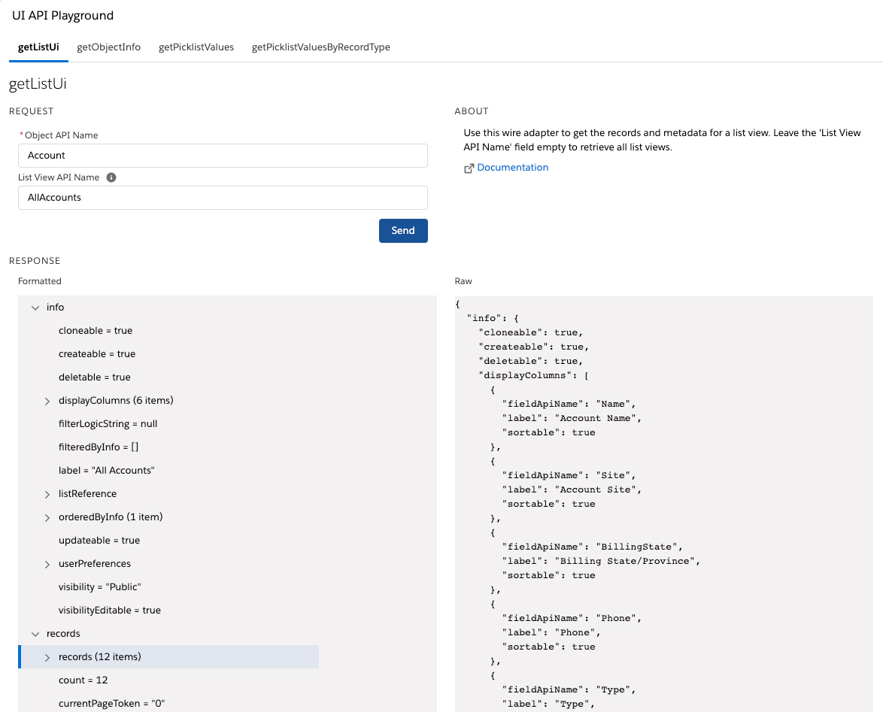

# UI API Playground

This is a sample Lightning Web Component (LWC) app that let's you explore the UI APIs and execute them.

**Note:** this app only lists the UI API endpoints that are [accessible from LWC](https://developer.salesforce.com/docs/component-library/documentation/en/48.0/lwc/lwc.reference_ui_api).<br/>
For the exhaustive list of REST endpoints, refer to [this documentation](https://developer.salesforce.com/docs/atlas.en-us.uiapi.meta/uiapi/ui_api_get_started.htm).



## Installation

Install the app by running this script:

 **MacOS or Linux**

 ```
 ./install-dev.sh
 ```

 **Windows**

 ```
 install-dev.bat
 ```

The script automatically opens the playground but you can find it later in the **UI API Playground** tab.
